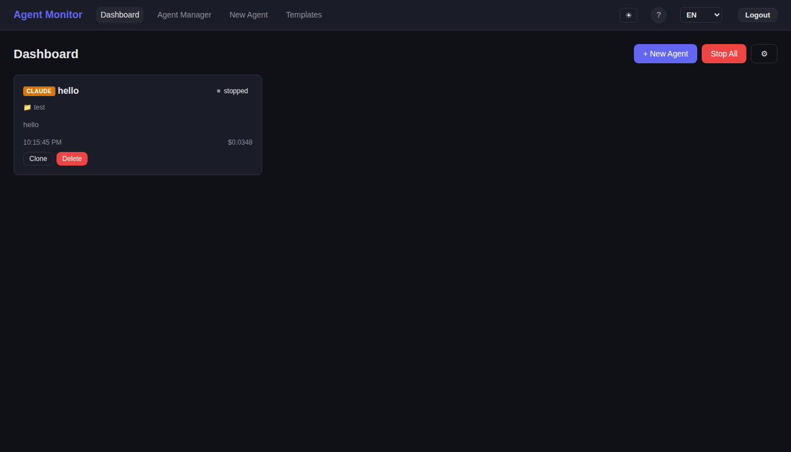

# Agent Monitor

[English](README.md) | **中文文档**

[](LICENSE)
[](https://nodejs.org/)
[](https://www.typescriptlang.org/)
[](https://react.dev/)
[](server/__tests__)

一个 Web 仪表盘，用于在同一界面运行、监控和管理 **Claude Code** 和 **Codex** 代理。实时流式输出、任务流水线、邮件 / WhatsApp / Slack 通知 —— 全部在浏览器中完成。

---

## 核心功能

### 多代理编排
- **统一仪表盘** —— 从单一界面创建、监控和管理 Claude Code 和 Codex 代理
- **任务流水线** —— 定义顺序和并行任务工作流；内置的 Meta Agent Manager 自动端到端执行
- **Git Worktree 隔离** —— 每个代理在独立分支中运行，多个代理同时操作同一仓库时不会冲突

### 实时监控与交互
- **实时流式输出** —— 通过 WebSocket 实时查看代理输出（本地和中继模式均支持）
- **Web 终端** —— 完整的聊天界面，支持 25+ 斜杠命令，与 CLI 行为一致
- **费用与 Token 追踪** —— 实时显示每个代理的费用（Claude）和 Token 使用量（Codex）
- **双击 Esc 中断** —— 按两次 Escape 向任何运行中的代理发送 SIGINT
- **自动删除过期代理** —— 可配置已停止代理的保留时间（默认 24 小时，可在设置中调整）

### 通知 —— 邮件、WhatsApp 和 Slack
随时随地获取通知。Agent Monitor 在代理需要人工介入时发送即时通知。

| 渠道 | 提供者 | 配置方式 |
|------|--------|----------|
| **邮件** | 任何 SMTP 服务器（Gmail、Outlook、Mailgun 等） | 配置 `SMTP_*` 环境变量 |
| **WhatsApp** | Twilio API | 配置 `TWILIO_*` 环境变量 |
| **Slack** | Slack Incoming Webhooks | 配置 `SLACK_WEBHOOK_URL` 或每个代理的 webhook |

通知在以下情况触发：
- 代理进入 `waiting_input` 状态，需要人工介入
- 流水线任务失败
- 卡住的代理超过可配置的超时阈值
- 整个流水线完成

所有渠道可同时启用 —— 为每个代理或全局配置管理员邮箱、WhatsApp 手机号和/或 Slack webhook。

> 查看 [通知指南](docs/guide/notifications.md) 获取详细配置说明。

### 远程访问 —— 中继服务器
- **随时随地访问** —— 通过公共中继服务器，从手机、笔记本或任何设备管理代理
- **安全 WebSocket 隧道** —— 代理机器向外连接中继服务器，无需开放入站端口
- **批量远程代理** —— 在高性能远程服务器上运行和监控大量代理，从任何轻量设备远程控制
- **密码保护仪表盘** —— 基于 JWT 的认证，会话有效期 24 小时
- **自动重连** —— 连接断开时隧道自动重连（指数退避策略）
- **本地零开销** —— 未配置中继时，服务器以纯本地模式运行，无额外消耗

```
手机 / 笔记本 ──HTTP──▶ 公共服务器（中继 :3457）◀──WS 隧道── 代理机器（:3456）
```

> 查看 [远程访问指南](docs/guide/remote-access.md) 获取配置说明。

### 模板与指令管理
- **CLAUDE.md 模板** —— 创建可复用的指令集，在启动代理时加载
- **自动检测 CLAUDE.md** —— 选择项目目录时，自动检测已有的 CLAUDE.md 并提供加载选项
- **实时编辑** —— 随时修改代理的 CLAUDE.md，无需重启
- **会话恢复** —— 从上次中断处继续 Claude Code 会话

### 国际化
- **7 种语言**：英语、中文、日语（日本語）、韩语（한국어）、西班牙语、法语、德语
- 语言选择器跨会话持久化

---

## 截图

| 仪表盘 | 任务流水线 |
|--------|-----------|
|  |  |

| 创建代理 | 模板 |
|----------|------|
|  |  |

| 多语言支持 |
|------------|
|  |

---

## 快速开始

### 前置条件

- **Node.js** >= 18
- **Claude Code CLI**（`claude`）—— 用于 Claude 代理
- **Codex CLI**（`codex`）—— 用于 Codex 代理
- **Git** —— 用于 worktree 隔离

### 安装

```bash
git clone <repo-url> && cd AgentMonitor
npm install
cd server && npm install && cd ..
cd client && npm install && cd ..
```

### 生产环境

```bash
cd client && npx vite build && cd ..
cd server && npx tsx src/index.ts
```

在浏览器中打开 **http://localhost:3456**。

### 开发环境

```bash
npm run dev    # 同时启动服务端（tsx watch）+ 客户端（vite dev）
```

- 客户端开发服务器：http://localhost:5173（代理 API 到 :3456）
- API 服务器：http://localhost:3456

---

## 配置

所有配置通过环境变量完成。将 `.env.example` 复制为 `.env` 并设置所需的值。

### 服务器

| 变量 | 默认值 | 说明 |
|------|--------|------|
| `PORT` | `3456` | 服务器端口 |
| `CLAUDE_BIN` | `claude` | Claude CLI 二进制文件路径 |
| `CODEX_BIN` | `codex` | Codex CLI 二进制文件路径 |

### 邮件通知（SMTP）

| 变量 | 默认值 | 说明 |
|------|--------|------|
| `SMTP_HOST` | — | SMTP 服务器主机名（如 `smtp.gmail.com`） |
| `SMTP_PORT` | `587` | SMTP 端口（`587` 为 STARTTLS，`465` 为 TLS） |
| `SMTP_SECURE` | `false` | 端口 465 时设为 `true` |
| `SMTP_USER` | — | SMTP 用户名 |
| `SMTP_PASS` | — | SMTP 密码或应用专用密码 |
| `SMTP_FROM` | `agent-monitor@localhost` | 发件人地址 |

### WhatsApp 通知（Twilio）

| 变量 | 默认值 | 说明 |
|------|--------|------|
| `TWILIO_ACCOUNT_SID` | — | Twilio 账户 SID |
| `TWILIO_AUTH_TOKEN` | — | Twilio 认证令牌 |
| `TWILIO_WHATSAPP_FROM` | — | 启用 WhatsApp 的 Twilio 电话号码（如 `+14155238886`） |

### Slack 通知（Webhook）

| 变量 | 默认值 | 说明 |
|------|--------|------|
| `SLACK_WEBHOOK_URL` | — | 默认 Slack Incoming Webhook URL |

### 远程中继（隧道）

| 变量 | 默认值 | 说明 |
|------|--------|------|
| `RELAY_URL` | — | 中继服务器的 WebSocket URL（如 `ws://your-server:3457/tunnel`） |
| `RELAY_TOKEN` | — | 隧道认证的共享密钥 |

> 如果未设置 SMTP、Twilio 或 Slack 凭据，相应的通知渠道将优雅地禁用 —— 事件将记录到服务器控制台。

---

## 使用方法

### 创建代理

1. 在仪表盘点击 **"+ 新建代理"**
2. 选择 **提供者** —— Claude Code 或 Codex
3. 设置 **名称**、**工作目录**（使用浏览按钮选择目录）和 **提示词**
4. 如果所选目录包含 `CLAUDE.md`，系统会提示您自动加载
5. 配置 **参数选项**（如 `--dangerously-skip-permissions`、`--chrome`、`--permission-mode`）
6. 可选加载 **CLAUDE.md 模板** 或编写自定义指令
7. 输入 **管理员邮箱**、**WhatsApp 手机号** 和/或 **Slack Webhook URL** 用于通知
8. 点击 **创建代理**

### 仪表盘

每个代理以丰富信息卡片形式显示，包含：
- **项目与 Git 分支** —— 代理正在哪个仓库和分支上工作
- **Pull Request 链接** —— 如果代理创建了 PR，会自动检测并显示直达链接
- **模型与上下文使用** —— 使用的 LLM 模型及上下文窗口消耗可视化进度条
- **状态** —— 代理是否正在工作、空闲或等待权限
- **任务描述** —— 代理当前正在做什么的摘要
- **MCP 服务器** —— 连接的 Model Context Protocol 服务器（从 `--mcp-config` 解析）
- **费用 / Token 追踪** —— 每个代理的费用（Claude）或 Token 使用量（Codex）

点击任何卡片打开完整的聊天界面。

### 代理聊天

发送消息、查看对话历史、双击 Esc 中断、使用斜杠命令：

`/help` `/clear` `/status` `/cost` `/stop` `/compact` `/model` `/export`

### 任务流水线

编排多步骤工作流，支持顺序和并行任务定义。Meta Agent Manager 自动分配代理、监控进度、在失败时发送通知、完成后清理。

### 模板

创建、编辑和复用跨代理的 CLAUDE.md 指令模板。

---

## API 参考

### 代理

| 方法 | 端点 | 说明 |
|------|------|------|
| GET | `/api/agents` | 列出所有代理 |
| GET | `/api/agents/:id` | 获取代理详情 |
| POST | `/api/agents` | 创建代理 |
| POST | `/api/agents/:id/stop` | 停止代理 |
| POST | `/api/agents/:id/message` | 发送消息 |
| POST | `/api/agents/:id/interrupt` | 中断代理（SIGINT） |
| PUT | `/api/agents/:id/claude-md` | 更新 CLAUDE.md |
| DELETE | `/api/agents/:id` | 删除代理 |
| POST | `/api/agents/actions/stop-all` | 停止所有代理 |

### 流水线任务

| 方法 | 端点 | 说明 |
|------|------|------|
| GET | `/api/tasks` | 列出流水线任务 |
| POST | `/api/tasks` | 创建任务 |
| DELETE | `/api/tasks/:id` | 删除任务 |
| POST | `/api/tasks/:id/reset` | 重置任务状态 |
| POST | `/api/tasks/clear-completed` | 清除已完成/失败的任务 |
| GET | `/api/meta/config` | 获取 Meta Agent 配置 |
| PUT | `/api/meta/config` | 更新 Meta Agent 配置 |
| POST | `/api/meta/start` | 启动 Meta Agent 管理器 |
| POST | `/api/meta/stop` | 停止 Meta Agent 管理器 |

### 模板

| 方法 | 端点 | 说明 |
|------|------|------|
| GET | `/api/templates` | 列出模板 |
| GET | `/api/templates/:id` | 获取模板 |
| POST | `/api/templates` | 创建模板 |
| PUT | `/api/templates/:id` | 更新模板 |
| DELETE | `/api/templates/:id` | 删除模板 |

### 设置

| 方法 | 端点 | 说明 |
|------|------|------|
| GET | `/api/settings` | 获取服务器设置（代理保留时间等） |
| PUT | `/api/settings` | 更新服务器设置 |

### 其他

| 方法 | 端点 | 说明 |
|------|------|------|
| GET | `/api/sessions` | 列出之前的 Claude 会话 |
| GET | `/api/directories?path=/home` | 浏览服务器目录 |
| GET | `/api/directories/claude-md?path=/project` | 检查目录中是否存在 CLAUDE.md |
| GET | `/api/health` | 健康检查 |

### Socket.IO 事件

| 事件 | 方向 | 说明 |
|------|------|------|
| `agent:join` | 客户端 → 服务端 | 订阅代理消息 |
| `agent:leave` | 客户端 → 服务端 | 取消订阅 |
| `agent:send` | 客户端 → 服务端 | 发送消息 |
| `agent:interrupt` | 客户端 → 服务端 | 发送中断 |
| `agent:message` | 服务端 → 客户端 | 代理输出（旧版） |
| `agent:update` | 服务端 → 客户端 | 完整代理快照（实时流式） |
| `agent:snapshot` | 服务端 → 客户端 | 仪表盘广播更新 |
| `agent:status` | 服务端 → 客户端 | 状态变更 |
| `task:update` | 服务端 → 客户端 | 流水线任务更新 |
| `pipeline:complete` | 服务端 → 客户端 | 流水线完成 |
| `meta:status` | 服务端 → 客户端 | Meta Agent 状态 |

---

## 远程访问（中继模式）

通过公共中继服务器从任何地方访问 Agent Monitor 仪表盘 —— 手机、笔记本或任何设备。中继通过安全隧道转发所有 HTTP 和 WebSocket 流量。

```
手机/笔记本 → HTTP → 公共服务器（中继 :3457）← WS 隧道 ← 本地机器（:3456）
```

### 配置步骤

1. **部署中继** 到公共服务器：
   ```bash
   bash relay/scripts/deploy.sh <你的密钥令牌> <你的仪表盘密码>
   ```

2. **连接本地服务器**，设置环境变量：
   ```bash
   RELAY_URL=ws://your-server:3457/tunnel RELAY_TOKEN=<你的密钥令牌> npx tsx server/src/index.ts
   ```

3. 从任何设备打开 **仪表盘** `http://your-server:3457` —— 使用密码登录

中继支持通过 `RELAY_PASSWORD` 进行 **密码登录**，保护仪表盘免受未授权访问。会话使用 24 小时过期的 JWT 令牌。隧道在连接断开时自动重连。未设置 `RELAY_URL` 时，服务器以纯本地模式运行，无中继开销。

---

## 提供者支持

| | Claude Code | Codex |
|---|---|---|
| **二进制文件** | `claude` | `codex` |
| **参数选项** | `--dangerously-skip-permissions`、`--permission-mode`、`--chrome`、`--max-budget-usd`、`--allowedTools`、`--disallowedTools`、`--add-dir`、`--mcp-config`、`--resume`、`--model` | `--dangerously-bypass-approvals-and-sandbox`、`--full-auto`、`--model` |
| **追踪** | 费用（USD） | Token 使用量 |

---

## 测试

```bash
npm test    # 40 个测试
```

---

## 架构

```
AgentMonitor/
  server/                   # Node.js + Express + Socket.IO
    src/
      services/
        AgentProcess.ts     # CLI 进程封装
        AgentManager.ts     # 代理生命周期管理
        MetaAgentManager.ts # 流水线编排
        TunnelClient.ts     # 到中继服务器的出站隧道
        tunnelBridge.ts     # 隧道事件桥接
        WorktreeManager.ts  # Git worktree 操作
        EmailNotifier.ts    # SMTP 邮件通知
        WhatsAppNotifier.ts # Twilio WhatsApp 通知
        SlackNotifier.ts    # Slack webhook 通知
        SessionReader.ts    # 会话历史
        DirectoryBrowser.ts # 目录浏览
      store/AgentStore.ts   # JSON 持久化
      routes/               # REST 端点
      socket/handlers.ts    # WebSocket 处理器
    __tests__/              # 测试套件
  relay/                    # 公共中继服务器（独立部署）
    src/
      index.ts              # 中继入口
      tunnel.ts             # TunnelManager（WS 服务端）
      httpProxy.ts          # HTTP 隧道转发
      socketBridge.ts       # Socket.IO ↔ 隧道桥接
      config.ts             # 中继配置
    scripts/deploy.sh       # 构建并部署到公共服务器
  client/                   # React + Vite
    src/
      pages/                # 仪表盘、聊天、流水线、模板
      i18n/                 # 7 种语言本地化（EN/ZH/JA/KO/ES/FR/DE）
      api/                  # REST + Socket.IO 客户端
```

---

## 许可证

MIT
